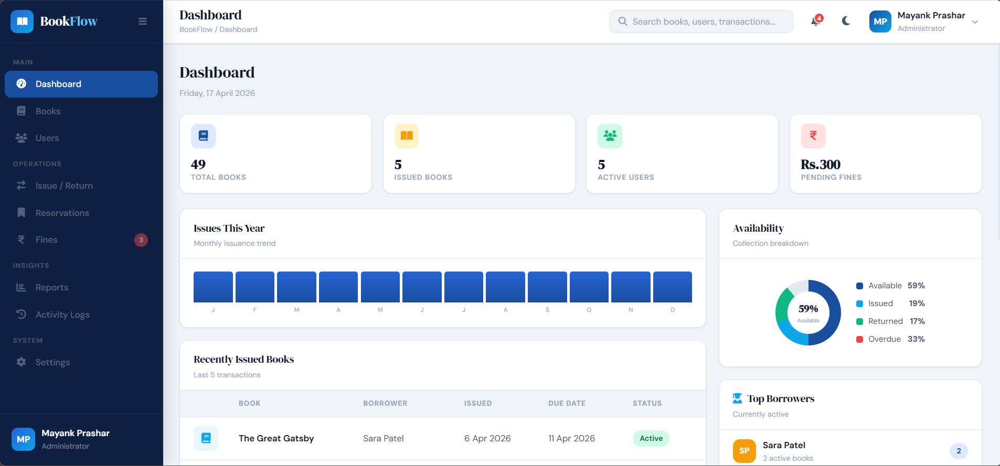

# BookFlow — Online Library Management System



> "Manage Knowledge, Not Chaos" — A scalable, role-based library management platform with secure authentication, book tracking, and administrative control.

[](https://developer.mozilla.org/en-US/docs/Web/HTML)
[](https://developer.mozilla.org/en-US/docs/Web/CSS)
[](https://developer.mozilla.org/en-US/docs/Web/JavaScript)
[](https://spring.io/projects/spring-boot)
[](https://www.mysql.com)
[](LICENSE)

---

## Overview

BookFlow is a full-stack library management system designed for educational institutions. It enables efficient book tracking, user management, and transaction handling through a secure and scalable architecture.

The system supports three distinct role-based panels: Admin, Librarian, and Student. Each role operates within controlled access boundaries enforced at both frontend and backend levels.

---

## Features

### Admin Panel

* User management and role assignment
* System monitoring and analytics
* Report generation
* Full administrative control

### Librarian Panel

* Add, update, and delete books
* Manage inventory and transactions
* Approve or reject book requests
* Track issued and returned books

### Student Panel

* Browse and search books
* Issue and return books
* View borrowing history
* Track fines and due dates

---

## Platform Capabilities

* Role-Based Access Control (RBAC)
* Secure authentication and authorization
* RESTful API architecture
* Layered backend structure (Controller → Service → Repository)
* Responsive user interface
* Modular and scalable design

---

## Project Structure

```
bookflow/
│
├── frontend/
│   ├── public/
│   │   └── index.html
│   │
│   ├── src/
│   │   ├── assets/
│   │   │   ├── images/
│   │   │   └── icons/
│   │   │
│   │   ├── css/
│   │   │   ├── global.css
│   │   │   ├── student.css
│   │   │   ├── librarian.css
│   │   │   └── admin.css
│   │   │
│   │   ├── js/
│   │   │   ├── app.js
│   │   │   ├── api.js
│   │   │   ├── auth.js
│   │   │   ├── role.js
│   │   │   └── utils.js
│   │   │
│   │   ├── pages/
│   │   │   ├── auth/
│   │   │   │   ├── login.html
│   │   │   │   └── register.html
│   │   │   │
│   │   │   ├── student/
│   │   │   │   ├── dashboard.html
│   │   │   │   ├── books.html
│   │   │   │   └── my-books.html
│   │   │   │
│   │   │   ├── librarian/
│   │   │   │   ├── dashboard.html
│   │   │   │   ├── manage-books.html
│   │   │   │   └── requests.html
│   │   │   │
│   │   │   ├── admin/
│   │   │   │   ├── dashboard.html
│   │   │   │   ├── users.html
│   │   │   │   └── reports.html
│   │   │
│   │   └── components/
│   │       ├── navbar.html
│   │       ├── sidebar.html
│   │       └── loader.html
│   │
│   ├── .env.example
│   └── README.md
│
├── backend/
│   ├── src/
│   │   ├── main/
│   │   │   ├── java/com/bookflow/
│   │   │   │
│   │   │   │   ├── controller/
│   │   │   │   │   ├── AuthController.java
│   │   │   │   │   ├── StudentController.java
│   │   │   │   │   ├── LibrarianController.java
│   │   │   │   │   └── AdminController.java
│   │   │   │   │
│   │   │   │   ├── service/
│   │   │   │   │   ├── AuthService.java
│   │   │   │   │   ├── BookService.java
│   │   │   │   │   ├── UserService.java
│   │   │   │   │   └── TransactionService.java
│   │   │   │   │
│   │   │   │   ├── repository/
│   │   │   │   │   ├── UserRepository.java
│   │   │   │   │   ├── BookRepository.java
│   │   │   │   │   └── TransactionRepository.java
│   │   │   │   │
│   │   │   │   ├── model/
│   │   │   │   │   ├── User.java
│   │   │   │   │   ├── Role.java
│   │   │   │   │   ├── Book.java
│   │   │   │   │   └── Transaction.java
│   │   │   │   │
│   │   │   │   ├── config/
│   │   │   │   │   ├── SecurityConfig.java
│   │   │   │   │   └── JwtConfig.java
│   │   │   │   │
│   │   │   │   ├── security/
│   │   │   │   │   ├── JwtFilter.java
│   │   │   │   │   └── CustomUserDetailsService.java
│   │   │   │   │
│   │   │   │   ├── dto/
│   │   │   │   │   ├── LoginRequest.java
│   │   │   │   │   └── AuthResponse.java
│   │   │   │   │
│   │   │   │   └── BookflowApplication.java
│   │   │   │
│   │   │   └── resources/
│   │   │       ├── application.properties
│   │   │       ├── data.sql
│   │   │       └── static/
│   │   │
│   │   └── test/
│   │
│   ├── pom.xml
│   └── README.md
│
├── database/
│   ├── schema.sql
│   └── seed.sql
│
├── docs/
│   ├── api.md
│   ├── architecture.md
│   └── roles.md
│
├── .github/
│   └── workflows/
│       └── ci.yml
│
├── docker/
│   ├── Dockerfile
│   └── docker-compose.yml
│
├── assets/
│   └── banner.png
│
├── .gitignore
├── LICENSE
└── README.md
```


---

## Tech Stack

| Layer    | Technology                          |
| -------- | ----------------------------------- |
| Frontend | HTML5, CSS3, JavaScript             |
| Backend  | Java, Spring Boot                   |
| Database | MySQL                               |
| Security | Spring Security, JWT                |
| Tools    | Git, GitHub, Postman, IntelliJ IDEA |

---

## Getting Started

### Clone the repository

```bash
git clone https://github.com/your-username/bookflow.git
cd bookflow
```

### Backend

```bash
cd backend
mvn spring-boot:run
```

### Frontend

Open `index.html` in browser.

---

## License

This project is licensed under the **MIT License** — see the [LICENSE](LICENSE) file for details.

---

## Author

**Mayank Prashar**

[](https://github.com/prash-mayank)
[](https://www.linkedin.com/in/prashmayank)
[](mailto:mayank.prash@gmail.com)

---

<p align="center">Built with precision for scalable systems and modern library management</p>
<p align="center">© 2024 BookFlow. All rights reserved.</p>
